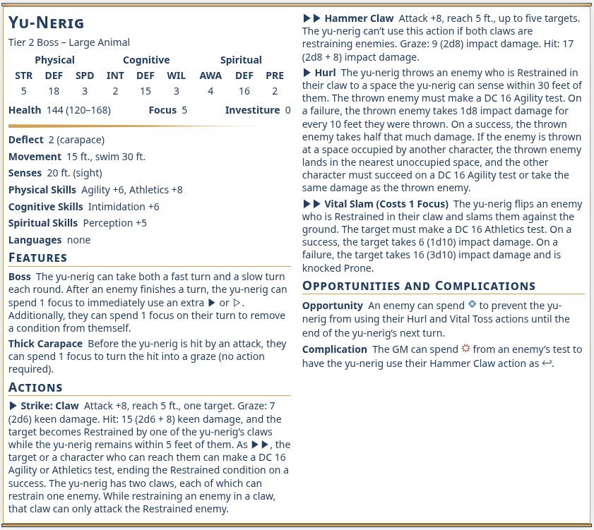

# CosmereRPG Adversary and Beast Extractor

Extracts beasts and adversaries from Rulebook PDFs.

## Structure

The structure is currently undocumented and not stable. It is mostly designed to best fit with [Fantasy Statblocks for Obsidian](https://plugins.javalent.com/statblocks) using [this layout and style](./obsidian-fantasy-statblocks):



## Web

Easiest use is to use the [web version](https://modprog.github.io/cosmere-rpg-beast-extractor/). It works completely locally and does not upload the selected file to any server.

## CLI
Currently there is no build that can be installed. You have to [install rust](https://rust-lang.org/tools/install/) and download the source code above. Then run this command in the repo:
```
cargo run -- --pdf "/Path/of/the/Stormlight-Worldguide.pdf" --out-dir "output/folder" --pages 191-269 --format yaml # or obsidian-frontmatter
```

# Development Notes
Some tests run on the actual PDFs, for obvious reasons I can put neither the PDFs nor the extracted results in this repo, so the folder `copyrighted` must be generated by anyone that wants to set up their own development environment.

This is only strictly necessary when working on the PDF-Parsing, as the text post-processing can be easily unit tested without said PDFs.
